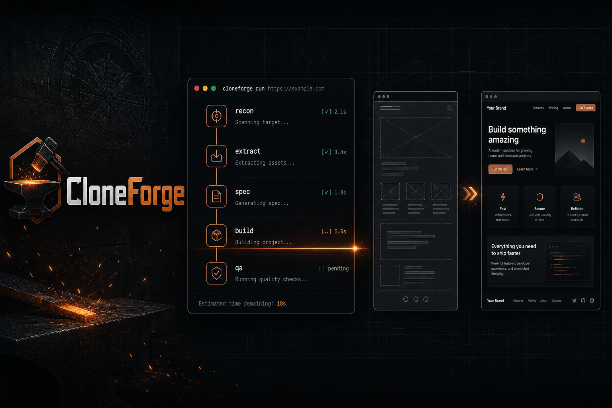

# MirrorCraft

<p align="center">
  <strong>Forge any website into a clean Next.js app — with Cursor, Claude Code, and other AI agents.</strong>
</p>

<p align="center">
  <a href="https://github.com/abuzar310/mirrorcraft/blob/main/LICENSE"></a>
  <a href="https://github.com/abuzar310/mirrorcraft/stargazers"></a>
  
  
  
</p>

<p align="center">
  <a href="https://github.com/abuzar310/mirrorcraft/generate"><b>Use this template</b></a> ·
  <a href="#quick-start">Quick start</a> ·
  <a href="#how-it-works">How it works</a> ·
  <a href="#supported-agents">Agents</a>
</p>

<p align="center">
  <a href="https://vercel.com/new/clone?repository-url=https://github.com/abuzar310/mirrorcraft"></a>
</p>

<p align="center">
  <a href="https://mirrorcraft-orcin.vercel.app"><b>Live demo →</b></a>
</p>

## Demo

[](https://mirrorcraft-orcin.vercel.app)

> Live landing: [mirrorcraft-orcin.vercel.app](https://mirrorcraft-orcin.vercel.app) · click the image to open it.

---

Point your AI coding agent at a URL, run `/clone-website`, and watch it:

1. **Inspect** the live page (screenshots, tokens, interactions)
2. **Extract** assets + exact `getComputedStyle()` values
3. **Spec** every section before building
4. **Forge** components in parallel worktrees
5. **Ship** a compiling Next.js + Tailwind v4 + shadcn site

> **Why MirrorCraft?** Same powerful clone pipeline as the community original — plus Cursor-first docs, Node **20+** (not 24-only), a showcase landing you can demo, and a one-command `npm run setup`.

## Quick Start

> Use **[Use this template](https://github.com/abuzar310/mirrorcraft/generate)** so you get your own repo. Don’t open PRs here with generated website clones.

```bash
# after creating your copy from the template
git clone https://github.com/YOUR-USERNAME/YOUR-REPO.git
cd YOUR-REPO

npm run setup          # Node 20+ check + npm install
npm run dev            # preview MirrorCraft landing

# then in Cursor / Claude Code / your agent:
/clone-website https://example.com
```

**Cursor:** open the project → Agent chat → `/clone-website <url>` (browser MCP enabled).  
**Claude Code:** `claude` then `/clone-website <url>` (Chrome MCP recommended).

Other agents: see [`AGENTS.md`](./AGENTS.md).

## Demo landing

`npm run dev` serves a **MirrorCraft** showcase page (forge aesthetic + pipeline UI).  
Running `/clone-website` replaces `src/app/page.tsx` with your clone — that’s expected.

**Smoke test included:** Playwright extraction of [example.com](https://example.com) → `/demos/example`

```bash
npm run smoke:example   # re-extract tokens + screenshot
npm run dev             # open http://localhost:3000/demos/example
```

Artifacts: `docs/research/example.com/`, `docs/design-references/example.com/`

## Supported agents

| Agent | Notes |
| ----- | ----- |
| **[Cursor](https://cursor.com/)** | **First-class** — built-in browser MCP + `/clone-website` command |
| [Claude Code](https://docs.anthropic.com/en/docs/claude-code) | Excellent with Opus + Chrome MCP |
| [Codex CLI](https://github.com/openai/codex) | Supported |
| [GitHub Copilot](https://github.com/features/copilot) | Supported |
| [Windsurf](https://codeium.com/windsurf) | Supported |
| [OpenCode](https://opencode.ai/) | Supported |
| [Gemini CLI](https://github.com/google-gemini/gemini-cli) | Supported |
| [Cline](https://github.com/cline/cline) / [Roo](https://github.com/RooCodeInc/Roo-Code) | Supported |
| [Aider](https://aider.chat/) / [Continue](https://continue.dev/) / [Amazon Q](https://aws.amazon.com/q/developer/) / [Augment](https://www.augmentcode.com/) | Supported |

## Prerequisites

- [Node.js](https://nodejs.org/) **20+**
- An AI coding agent with **browser automation** (Cursor Browser, Chrome MCP, Playwright MCP, etc.)

## Tech stack

- **Next.js 16** — App Router, React 19, TypeScript
- **shadcn/ui** + **Tailwind CSS v4** — oklch / design tokens
- **Lucide** — default icons (swapped for extracted SVGs during clones)

## How it works

The `/clone-website` skill runs a multi-phase pipeline:

1. **Reconnaissance** — screenshots, tokens, scroll/click/hover/responsive sweep  
2. **Foundation** — fonts, colors, globals, downloaded assets  
3. **Component specs** — auditable files in `docs/research/components/`  
4. **Parallel build** — one builder per section/component (worktrees)  
5. **Assembly & QA** — merge, wire the page, visual check, `npm run build`

Builders get exact CSS, interaction models, multi-state content, and asset paths — not vibes.

## Use cases

- **Platform migration** — WordPress / Webflow / Squarespace → Next.js  
- **Lost source** — live site, dead repo → modern codebase  
- **Learning** — deconstruct real production layouts and motion  

## Not for

- Phishing, impersonation, or fraud  
- Passing off someone else’s brand/design as yours  
- Ignoring a site’s terms of service  

## Project structure

```
src/app/                 # Routes (showcase until you clone)
src/components/ui/       # shadcn primitives
docs/research/           # Extraction + component specs
docs/design-references/  # Screenshots
.claude/skills/          # Source skill (sync → all agents)
.cursor/commands/        # Cursor /clone-website
AGENTS.md                # Agent instructions (source of truth)
```

## Commands

```bash
npm run setup       # verify Node + install
npm run dev         # http://localhost:3000
npm run build
npm run check       # lint + typecheck + build
npm run sync:skills # regenerate skill copies for all agents
```

Docker: `docker compose up app --build` or `docker compose up dev --build` (port 3001).

## Updating agent files

| What | Edit this | Then run |
| ---- | --------- | -------- |
| Project instructions | `AGENTS.md` | `npm run sync:agents` (or `bash scripts/sync-agent-rules.sh`) |
| Clone skill | `.claude/skills/clone-website/SKILL.md` | `npm run sync:skills` |

## Upstream

Forked and evolved from [JCodesMore/ai-website-cloner-template](https://github.com/JCodesMore/ai-website-cloner-template) (MIT). See [NOTICE.md](./NOTICE.md).

## Star History

[](https://star-history.com/#abuzar310/mirrorcraft&Date)

If MirrorCraft saves you a weekend — **star the repo**. It helps others find it.

Growth ideas for maintainers: [`docs/STAR_PLAYBOOK.md`](./docs/STAR_PLAYBOOK.md).

## License

MIT — Copyright JCodesMore & abuzar310

---

## MirrorCraft responsible-use note

MirrorCraft is intended for websites, interfaces, and assets you own, are licensed to use, or have permission to reproduce. Server-side systems, private APIs, credentials, protected data, and third-party proprietary assets are outside the scope of this toolkit.

This repository includes MIT-licensed upstream work. The required copyright and permission notice is preserved in `LICENSE`.
